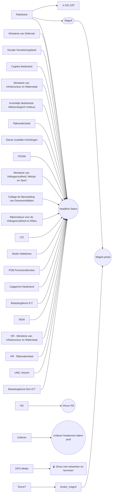

# zzp_inhuur_diagram

Een diagram van de Nederlandse ZZP inhuur markt

De volgende zijn de basis elementen van het diagram.

```mermaid
flowchart LR
    klant["Klant"]
    broker([Broker])
    portal((Portal/marktplaats))
    preferred[\Preferred supplier/]

    klant --> broker
    klant --> portal
    klant --> preferred
```

```mermaid
flowchart LR
state_no_zzp["☠ NO ZZP"]
klant_rabobank["Rabobank"]
klant_ns["NS"]
klant_tennet["TenneT"]
klant_rabobank["Rabobank"]
klant_ministerie_van_defensie["Ministerie van Defensie"]
klant_sociale_verzekeringsbank["Sociale Verzekeringsbank"]
klant_cegeka_nederland["Cegeka Nederland"]
klant_ministerie_van_infrastructuur_en_waterstaat["Ministerie van Infrastructuur en Waterstaat"]
klant_koninklijk_nederlands_meteorologisch_instituut["Koninklijk Nederlands Meteorologisch Instituut"]
klant_rijkswaterstaat["Rijkswaterstaat"]
klant_dienst_justitiële_inrichtingen["Dienst Justitiële Inrichtingen"]
klant_pggm["PGGM"]
klant_ministerie_van_volksgezondheid,_welzijn_en_sport["Ministerie van Volksgezondheid, Welzijn en Sport"]
klant_college_ter_beoordeling_van_geneesmiddelen["College ter Beoordeling van Geneesmiddelen"]
klant_rijksinstituut_voor_de_volksgezondheid_en_milieu["Rijksinstituut voor de Volksgezondheid en Milieu"]
klant_ciz["CIZ"]
klant_stedin_netbeheer["Stedin Netbeheer"]
klant_pgb_pensioendiensten["PGB Pensioendiensten"]
klant_capgemini_nederland_["Capgemini Nederland "]
klant_belastingdienst_ict["Belastingdienst ICT"]
klant_ndw["NDW"]
klant_hr_ministerie_van_infrastructuur_en_waterstaat["HR - Ministerie van Infrastructuur en Waterstaat"]
klant_hr_rijkswaterstaat["HR - Rijkswaterstaat"]
klant_umc_utrecht["UMC Utrecht"]
klant_belastingdienst_non_ict["Belastingdienst Non-ICT"]
klant_unilever["Unilever"]
klant_dpg_media["DPG Media"]

boker_magnit([Magnit])

das_headfirst_select((Headfirst Select))
click das_headfirst "https://platform.select.hr/" "https://platform.select.hr/"
das_ns(("Inhuur NS"))
click das_ns "https://inhuur-ns.my.site.com/" "https://inhuur-ns.my.site.com/"

das_magnit(("Magnit portal"))
click das_ns "https://portal.magnitglobal.com/" "https://portal.magnitglobal.com/"

das_unilever_talentpool(("Unilever freelancers talent-pool"))
click das_unilever_talentpool "https://unileverfreelancers.talent-pool.com/" "https://unileverfreelancers.talent-pool.com/"

das_human("🫂 Direct met netwerken en kennisen")


klant_rabobank --> state_no_zzp
klant_rabobank --> boker_magnit --> das_magnit

klant_ns --> das_ns

klant_tennet --> broker_magnit --> das_magnit

klant_rabobank --> das_headfirst_select
klant_ministerie_van_defensie --> das_headfirst_select
klant_sociale_verzekeringsbank --> das_headfirst_select
klant_cegeka_nederland --> das_headfirst_select
klant_ministerie_van_infrastructuur_en_waterstaat --> das_headfirst_select
klant_koninklijk_nederlands_meteorologisch_instituut --> das_headfirst_select
klant_rijkswaterstaat --> das_headfirst_select
klant_dienst_justitiële_inrichtingen --> das_headfirst_select
klant_pggm --> das_headfirst_select
klant_ministerie_van_volksgezondheid,_welzijn_en_sport --> das_headfirst_select
klant_college_ter_beoordeling_van_geneesmiddelen --> das_headfirst_select
klant_rijksinstituut_voor_de_volksgezondheid_en_milieu --> das_headfirst_select
klant_ciz --> das_headfirst_select
klant_stedin_netbeheer --> das_headfirst_select
klant_pgb_pensioendiensten --> das_headfirst_select
klant_capgemini_nederland_ --> das_headfirst_select
klant_belastingdienst_ict --> das_headfirst_select
klant_ndw --> das_headfirst_select
klant_hr_ministerie_van_infrastructuur_en_waterstaat --> das_headfirst_select
klant_hr_rijkswaterstaat --> das_headfirst_select
klant_umc_utrecht --> das_headfirst_select
klant_belastingdienst_non_ict --> das_headfirst_select

klant_unilever --> das_unilever_talentpool
klant_dpg_media --> das_human
```

