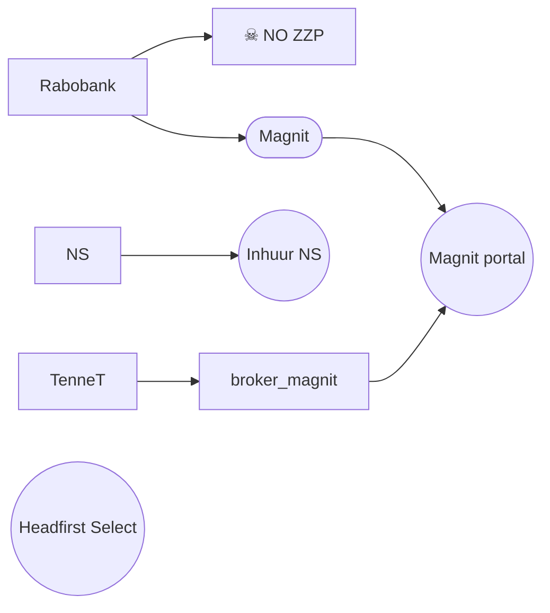

# zzp_inhuur_diagram
Een diagram van de Nederlandse ZZP inhuur markt

```mermaid
flowchart LR
    klant["Klant"]
    broker([Broker])
    portal((Portal/marktplaats))
    preferred[\Preferred supplier/]

    klant --> broker
    klant --> portal
    klant --> preferred
```

```mermaid
flowchart LR
    state_no_zzp["☠ NO ZZP"]
    klant_rabobank["Rabobank"]
    klant_ns["NS"]
    klant_tennet["TenneT"]

    boker_magnit([Magnit])

    das_headfirst_select((Headfirst Select))
    click das_headfirst "https://platform.select.hr/" "https://platform.select.hr/"
    das_ns(("Inhuur NS"))
    click das_ns "https://inhuur-ns.my.site.com/" "https://inhuur-ns.my.site.com/"

    das_magnit(("Magnit portal"))
    click das_ns "https://portal.magnitglobal.com/" "https://portal.magnitglobal.com/"


    klant_rabobank --> state_no_zzp
    klant_rabobank --> boker_magnit --> das_magnit

    klant_ns --> das_ns

    klant_tennet --> broker_magnit --> das_magnit
```

