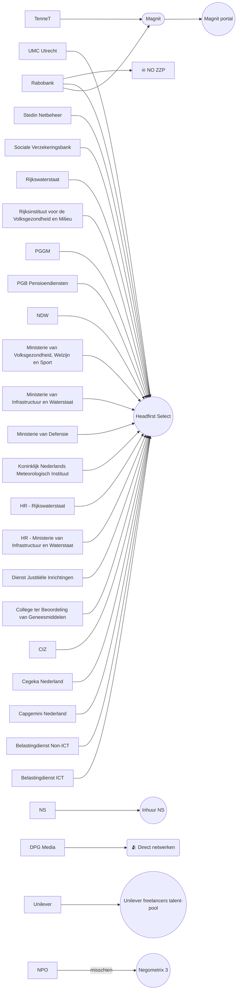

```mermaid
flowchart LR
state_no_zzp["☠ NO ZZP"]

klant_belastingdienst_ict["Belastingdienst ICT"]
klant_belastingdienst_non_ict["Belastingdienst Non-ICT"]
klant_capgemini_nederland_["Capgemini Nederland "]
klant_cegeka_nederland["Cegeka Nederland"]
klant_ciz["CIZ"]
klant_college_ter_beoordeling_van_geneesmiddelen["College ter Beoordeling van Geneesmiddelen"]
klant_dienst_justitiële_inrichtingen["Dienst Justitiële Inrichtingen"]
klant_dpg_media["DPG Media"]
klant_hr_ministerie_van_infrastructuur_en_waterstaat["HR - Ministerie van Infrastructuur en Waterstaat"]
klant_hr_rijkswaterstaat["HR - Rijkswaterstaat"]
klant_koninklijk_nederlands_meteorologisch_instituut["Koninklijk Nederlands Meteorologisch Instituut"]
klant_ministerie_van_defensie["Ministerie van Defensie"]
klant_ministerie_van_infrastructuur_en_waterstaat["Ministerie van Infrastructuur en Waterstaat"]
klant_ministerie_van_volksgezondheid,_welzijn_en_sport["Ministerie van Volksgezondheid, Welzijn en Sport"]
klant_ndw["NDW"]
klant_npo["NPO"]
klant_ns["NS"]
klant_pgb_pensioendiensten["PGB Pensioendiensten"]
klant_pggm["PGGM"]
klant_rabobank["Rabobank"]
klant_rabobank["Rabobank"]
klant_rijksinstituut_voor_de_volksgezondheid_en_milieu["Rijksinstituut voor de Volksgezondheid en Milieu"]
klant_rijkswaterstaat["Rijkswaterstaat"]
klant_sociale_verzekeringsbank["Sociale Verzekeringsbank"]
klant_stedin_netbeheer["Stedin Netbeheer"]
klant_tennet["TenneT"]
klant_umc_utrecht["UMC Utrecht"]
klant_unilever["Unilever"]

broker_magnit(["Magnit"])

das_headfirst_select((Headfirst Select))
das_ns(("Inhuur NS"))
das_magnit(("Magnit portal"))
das_human("🫂 Direct netwerken")
das_unilever_talentpool(("Unilever freelancers talent-pool"))
das_negometrix(("Negometrix 3"))


klant_belastingdienst_ict --> das_headfirst_select
klant_belastingdienst_non_ict --> das_headfirst_select
klant_capgemini_nederland_ --> das_headfirst_select
klant_cegeka_nederland --> das_headfirst_select
klant_ciz --> das_headfirst_select
klant_college_ter_beoordeling_van_geneesmiddelen --> das_headfirst_select
klant_dienst_justitiële_inrichtingen --> das_headfirst_select
klant_dpg_media --> das_human
klant_hr_ministerie_van_infrastructuur_en_waterstaat --> das_headfirst_select
klant_hr_rijkswaterstaat --> das_headfirst_select
klant_koninklijk_nederlands_meteorologisch_instituut --> das_headfirst_select
klant_ministerie_van_defensie --> das_headfirst_select
klant_ministerie_van_infrastructuur_en_waterstaat --> das_headfirst_select
klant_ministerie_van_volksgezondheid,_welzijn_en_sport --> das_headfirst_select
klant_ndw --> das_headfirst_select
klant_npo -- misschien --> das_negometrix
klant_ns --> das_ns
klant_pgb_pensioendiensten --> das_headfirst_select
klant_pggm --> das_headfirst_select
klant_rabobank --> broker_magnit
klant_rabobank --> das_headfirst_select
klant_rabobank --> state_no_zzp
klant_rijksinstituut_voor_de_volksgezondheid_en_milieu --> das_headfirst_select
klant_rijkswaterstaat --> das_headfirst_select
klant_sociale_verzekeringsbank --> das_headfirst_select
klant_stedin_netbeheer --> das_headfirst_select
klant_tennet --> broker_magnit
klant_umc_utrecht --> das_headfirst_select
klant_unilever --> das_unilever_talentpool

broker_magnit --> das_magnit


%% Links for nodes
click das_headfirst "https://platform.select.hr/" "https://platform.select.hr/"
click das_ns "https://inhuur-ns.my.site.com/" "https://inhuur-ns.my.site.com/"
click das_negometrix "https://platform.negometrix.com/" "https://platform.negometrix.com/"
click das_unilever_talentpool "https://unileverfreelancers.talent-pool.com/" "https://unileverfreelancers.talent-pool.com/"
click das_magnit "https://portal.magnitglobal.com/" "https://portal.magnitglobal.com/"
```